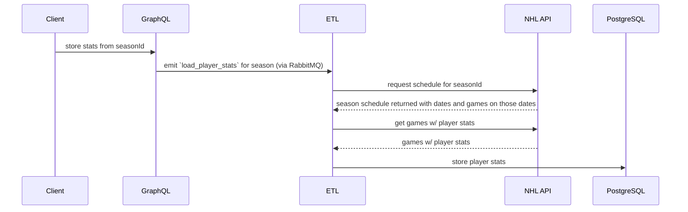
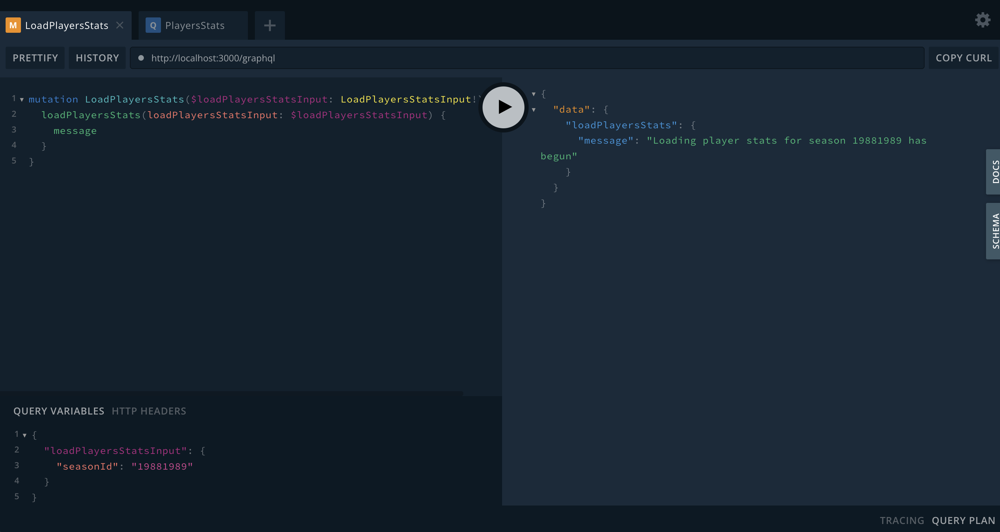
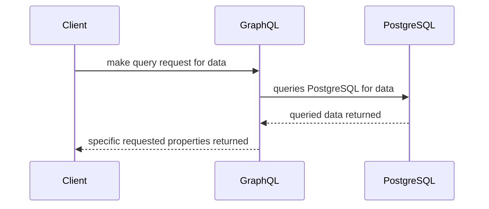
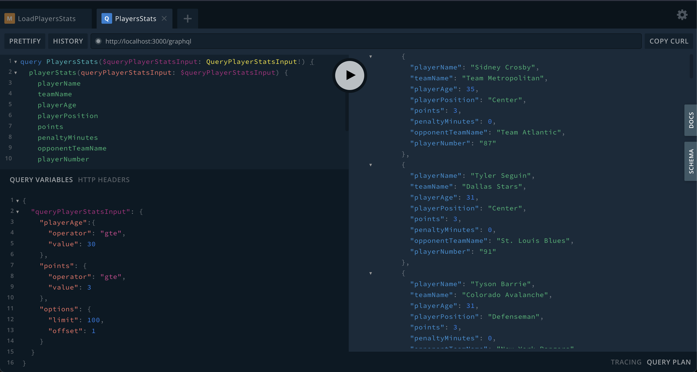

# Pipeline for NHL Data

I just wanted to have some fun with some data pipelines and messing around with [NestJS][nestjs]

- [Pipeline for NHL Data](#pipeline-for-nhl-data)
  - [Running locally](#running-locally)
  - [Usage](#usage)
  - [Components / Design Decisions](#components--design-decisions)
    - [GraphQL API](#graphql-api)
    - [RabbitMQ](#rabbitmq)
    - [Game Stats ETL](#game-stats-etl)
    - [PostgreSQL](#postgresql)
  - [Flow Diagrams](#flow-diagrams)
    - [Storing player stats](#storing-player-stats)
    - [Querying stats](#querying-stats)
  - [What else I would do](#what-else-i-would-do)
  - [Resources](#resources)

## Running locally

To run this application with all of its components you will need to have Docker installed. If you want to run any of the unit tests or run the services individually without the likes of PostgreSQL or RabbitMq you will need to have NodeJS installed. Links to those can be found in the [resources](#resources) section.

Running docker compose for the first time you'll need to build the docker images from the local docker files along pulling any missing docker images you do not have locally. This can be done with the command below

```bash
docker compose up --build --pull missing -d
```

Once you're done you can stop all services by running

```bash
docker compose down
```

## Usage

After running the `docker compose up` command before using the API check the health check (GET http://localhost:3000/health) since RabbitMQ takes some time to setup even with the queue already being created and also for PostgreSQL to initialize itself for the first time.

Once everything is up and running you can check out the GraphQL schema and documentation by going to the [playground](https://docs.nestjs.com/graphql/quick-start#graphql-playground) at http://localhost:3000/graphql

## Components / Design Decisions

### GraphQL API

I went with a GraphQL API because I thought about how a player's stats could/would be queried. If someone wanted to query for all game stats where a player scored more than 2 goals in a game, from a specific position against the New Jersey Devils they would be able to query that using the same endpoint as someone who would want to query all of the players with a number of hits for the Florida Panthers. GraphQL also provides a simple way to write/view documentation for those endpoints.

### RabbitMQ

I knew that I wanted to use a microservice architecture and with that would be using message passing to tell the [ETL service](#game-stats-etl) that there was another game or season's worth of games to load into the database.

### Game Stats ETL

This service is what receives a request to either load a game or a season's worth of games into the database to to be queried later. It also checks game status (if a game is live or not) to determine if it needs to continue to pull game data for storage.

### PostgreSQL

It's the database where all of the player's game stats are stored. I chose to to store all data in a single table since my focus was on player stats per game. If player info, stats, game info, team info were all in a separate table then I'd consider using a [SQL View][postgresViews] which would provide me a similar concept of this data all being in the same table

## Flow Diagrams

### Storing player stats

The diagram below goes over the flow when a seasonId is provided. The flow is the same when a gameId is sent except for the call to the NHL API to retrieve the season schedule





### Querying stats

The diagram below goes over the flow for querying player stats. The client makes a GraphQL query which gets transformed into a SQL query and the results are returned.





## What else I would do

Something else I would've considered doing if I didn't want to time box this would be to implement the streaming of game stats in the context of a live game scenario. To do this I would've added Kafka for the streaming from PostgreSQL in combination of using GraphQL's subscription to get real-time stat updates.

Another addition would be an events API. The purpose of this would be to allow for the user(s) to be able to query stats currently being processed based on a status identifier. So if player stats are currently being loaded based on a game or season id there would be an identifier or correlation id that can be used to query if there were errors in the ingestion process or if it's finished and the duration of the loading of player stats.

Also, more tests...

## Resources

- [NestJs][nestjs]
- [RabbitMq](https://www.rabbitmq.com/)
- [GraphQL](https://graphql.org/)
- [GraphQL Subscriptions](https://www.apollographql.com/docs/react/data/subscriptions/)
- [Kafka](https://kafka.apache.org/)
- [Kafka Streams](https://kafka.apache.org/documentation/streams/)
- [PostgreSQL](https://www.postgresql.org/)
- [PostgreSQL Views][postgresViews]
- [Docker](https://www.docker.com/)
- [NodeJS](https://nodejs.org/en)

[nestjs]: https://nestjs.com/
[postgresViews]: https://www.postgresql.org/docs/current/tutorial-views.html
