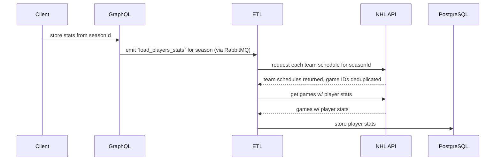
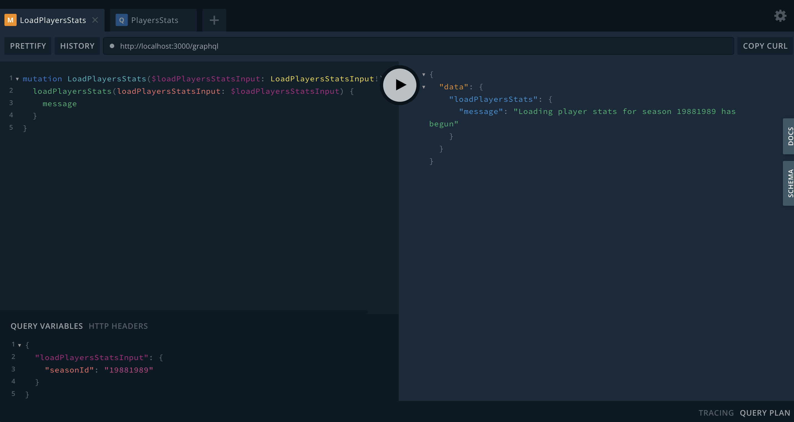
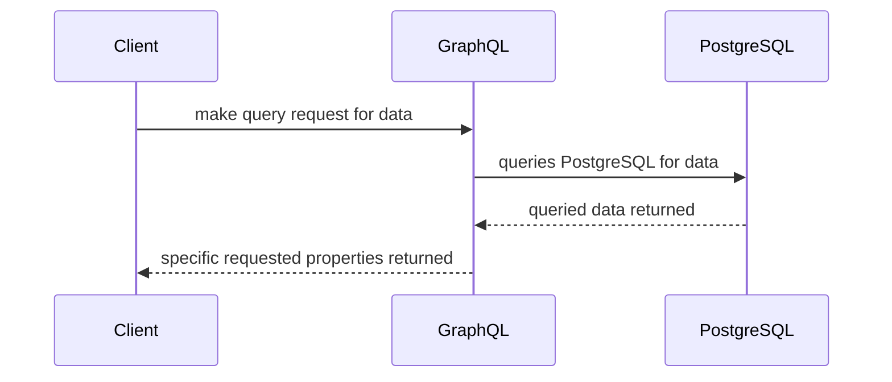
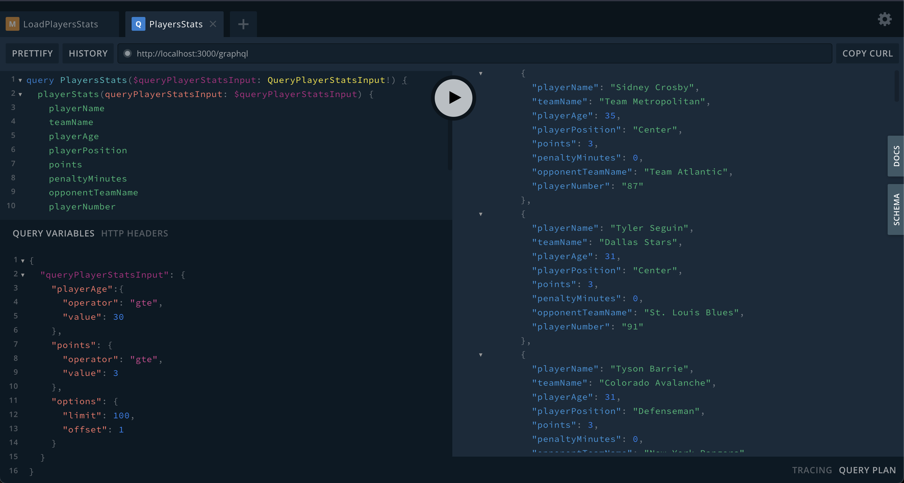

# Pipeline for NHL Data

I just wanted to have some fun with some data pipelines and messing around with [NestJS][nestjs]

- [Pipeline for NHL Data](#pipeline-for-nhl-data)
  - [Running locally](#running-locally)
  - [Usage](#usage)
    - [Load Game/Season](#load-gameseason)
    - [Query player stats](#query-player-stats)
  - [NHL data source](#nhl-data-source)
  - [Components / Design Decisions](#components--design-decisions)
    - [GraphQL API](#graphql-api)
    - [RabbitMQ](#rabbitmq)
    - [Game Stats ETL](#game-stats-etl)
    - [PostgreSQL](#postgresql)
  - [Flow Diagrams](#flow-diagrams)
    - [Storing player stats](#storing-player-stats)
    - [Querying stats](#querying-stats)
  - [What else I would do](#what-else-i-would-do)
  - [Resources](#resources)

## Running locally

To run this application with all of its components you will need to have Docker installed. If you want to run any of the unit tests or run the services individually without the likes of PostgreSQL or RabbitMq you will need to have NodeJS installed. Links to those can be found in the [resources](#resources) section.

Running docker compose for the first time you'll need to build the docker images from the local docker files along pulling any missing docker images you do not have locally. This can be done with the command below

```bash
docker compose up --build --pull missing -d
```

Once you're done you can stop all services by running

```bash
docker compose down
```

### Starting only PostgreSQL

For a clean-machine database check, or if the full stack does not come up,
run the database helper from the repository root:

```bash
./scripts/start-db.sh
```

It creates the local PostgreSQL data directory, pulls the pinned database
image if necessary, starts only the `db` service, and waits until it accepts
connections on `localhost:5432`. Inspect a failure with `docker compose logs db`.

The external images, Node build images, and Nest build CLI are pinned to releases
current when this repository was last updated (20 August 2023), so future builds
do not silently use newer `latest` dependencies.

## Usage

After running `docker compose up`, wait until all services are running before sending a load request. Check the API health endpoint at <http://localhost:3000/health> and use `docker compose ps` to verify that the API, ETL, RabbitMQ, and PostgreSQL containers are up. RabbitMQ and the ETL consumer can take a few seconds to initialize after the API health endpoint responds.

Once everything is up, open the GraphQL schema and documentation at <http://localhost:3000/graphql>.

### Load Game/Season

Before you can query any player stats you first need to load some data you can do so by loading a season or a game

request

```graphql
mutation LoadPlayersStats($loadPlayersStatsInput: LoadPlayersStatsInput!) {
  loadPlayersStats(loadPlayersStatsInput: $loadPlayersStatsInput) {
    message
  }
}
```

variables (loading a season)

```json
{
  "loadPlayersStatsInput": {
    "seasonId": "20182019"
  }
}
```

variables (loading a game)

```json
{
  "loadPlayersStatsInput": {
    "gameId": 2018020003
  }
}
```

The mutation queues an asynchronous ingestion job, so it returning a message means the job was accepted—not that rows have already been saved. Wait briefly, then query the stats or inspect the ETL logs with `docker compose logs etl`.

### Query player stats

Once player stats have been loaded you can begin to query player stats. The example below returns results where players recorded at least 3 points in a game against the Ottawa Senators (opponentTeamId: 9) or the Los Angeles Kings (opponentTeamId: 26).

```graphql
query PlayersStats($queryPlayerStatsInput: QueryPlayerStatsInput!) {
  playerStats(queryPlayerStatsInput: $queryPlayerStatsInput) {
    playerName
    teamName
    playerAge
    playerPosition
    points
    penaltyMinutes
    opponentTeamName
    playerNumber
    teamId
    teamName
    opponentTeamId
    opponentTeamName
  }
}
```

For example, after loading game `2018020003`, query its rows directly:

```graphql
query GameStats {
  playerStats(queryPlayerStatsInput: { gameIds: [2018020003] }) {
    gameId
    playerName
    teamName
    goals
    assists
    points
  }
}
```

variables

```json
{
  "queryPlayerStatsInput": {
    "points": {
      "operator": "gte",
      "value": 3
    },
    "opponentTeamIds": [9, 26],
    "options": {
      "limit": 100,
      "offset": 1
    }
  }
}
```

## NHL data source

The original NHL stats API used by this project is no longer available. The ETL now uses the NHL's current web API at <https://api-web.nhle.com/v1>:

- A game is loaded from `/gamecenter/{gameId}/boxscore`.
- A season is assembled from each team's `/club-schedule-season/{teamAbbrev}/{seasonId}` schedule. The resulting game IDs are deduplicated before ingestion.
- The service saves completed (`FINAL` or `OFF`) and in-progress (`LIVE` or `CRIT`) games. Season loading processes up to four games concurrently.

The NHL API is external and its responses can change independently of this project. A known completed game such as `2018020003` is useful as a quick smoke test.

## Components / Design Decisions

### GraphQL API

I went with a GraphQL API because I thought about how a player's stats could/would be queried. If someone wanted to query for all game stats where a player scored more than 2 goals in a game, from a specific position against the New Jersey Devils they would be able to query that using the same endpoint as someone who would want to query all of the players with a number of hits for the Florida Panthers. GraphQL also provides a simple way to write/view documentation for those endpoints.

### RabbitMQ

I knew that I wanted to use a microservice architecture and with that would be using message passing to tell the [ETL service](#game-stats-etl) that there was another game or season's worth of games to load into the database.

### Game Stats ETL

This service receives a request to load either one game or a season's games into the database for later querying. It stores player statistics when the NHL API reports a game as `LIVE`, `CRIT`, `FINAL`, or `OFF`; it does not continuously poll a live game for updates.

### PostgreSQL

It's the database where all of the player's game stats are stored. I chose to to store all data in a single table since my focus was on player stats per game. If player info, stats, game info, team info were all in a separate table then I'd consider using a [SQL View][postgresViews] which would provide me a similar concept of this data all being in the same table

## Flow Diagrams

### Storing player stats

The diagram below goes over the flow when a seasonId is provided. The flow is the same when a gameId is sent except for the call to the NHL API to retrieve the season schedule


```mermaid
sequenceDiagram
  Client->>GraphQL: store stats from seasonId
  GraphQL->>ETL: emit `load_players_stats` for season (via RabbitMQ)
  ETL->>NHL API: request each team schedule for seasonId
  NHL API-->>ETL: team schedules returned, game IDs deduplicated
  ETL->>NHL API: get games w/ player stats
  NHL API-->>ETL: games w/ player stats
  ETL->>PostgreSQL: store player stats

```



### Querying stats

The diagram below goes over the flow for querying player stats. The client makes a GraphQL query which gets transformed into a SQL query and the results are returned.


```mermaid
sequenceDiagram
  Client->>GraphQL: make query request for data
  GraphQL->>PostgreSQL: queries PostgreSQL for data
  PostgreSQL-->>GraphQL: queried data returned
  GraphQL-->>Client: specific requested properties returned
```



## What else I would do

Something else I would've considered doing if I didn't want to time box this would be to implement the streaming of game stats in the context of a live game scenario. To do this I would've added Kafka for the streaming from PostgreSQL in combination of using GraphQL's subscription to get real-time stat updates.

In regards to querying, filters are currently combined with AND. I would add a way for callers to choose AND or OR behavior, while retaining the comparison operators used by the age and statistic filters.

Another addition would be an events API. The purpose of this would be to allow for the user(s) to be able to query stats currently being processed based on a status identifier. So if player stats are currently being loaded based on a game or season id there would be an identifier or correlation id that can be used to query if there were errors in the ingestion process or if it's finished and the duration of the loading of player stats.

Also, more tests...

## Resources

- [NestJs][nestjs]
- [RabbitMq](https://www.rabbitmq.com/)
- [GraphQL](https://graphql.org/)
- [GraphQL Subscriptions](https://www.apollographql.com/docs/react/data/subscriptions/)
- [Kafka](https://kafka.apache.org/)
- [Kafka Streams](https://kafka.apache.org/documentation/streams/)
- [PostgreSQL](https://www.postgresql.org/)
- [PostgreSQL Views][postgresViews]
- [Docker](https://www.docker.com/)
- [NodeJS](https://nodejs.org/en)

[nestjs]: https://nestjs.com/
[postgresViews]: https://www.postgresql.org/docs/current/tutorial-views.html
